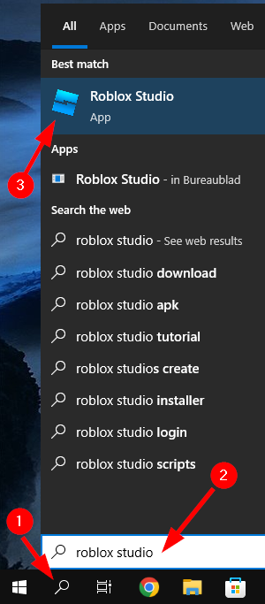

Om te beginnen aan ons avontuur moeten we eerst roblox studio instaleren. Als je op je computer al is een keer roblox hebt gespeelt. Dan zal roblox studio ook al op je computer staan. Als dit niet het geval is moet je gewoon een roblox spel opstarten. als eht spel is opgestart mag je dit sluiten. Roblox studio word automatisch geinstaleerd smaen met roblox.

# Roblox studio openen

## windows
1. druk op de zoek knop links beneden op je scherm.
2. type "roblox studio" in het zoek veld.
3. klik vervolgens op roblox studio.

Roblox studio zal nu opstarten

